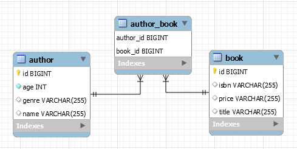

## The Best Way To Implement A Bidirectional `@ManyToMany` Association

**Description:** This application is a proof of concept of how it is correct to implement the bidirectional `@ManyToMany` association from the performance perspective.

**Key points:**

- choose an owning and a `mappedBy` side
- materialize the relationships collections via `Set` not `List`
- use helper methods on the owner of the relationship to keep both sides of the association in sync
- on the owner of the relationship use `CascadeType.PERSIST` and `CascadeType.MERGE`, but avoid `CascadeType.REMOVE/ALL`
- on the owner of the relationship set up join table
- `@ManyToMany` is lazy by default; keep it this way!
- as entities identifiers, use assigned identifiers (business key, natural key `(@NaturalId)`) and/or database-generated identifiers and override (on both sides) properly the `equals()` and `hashCode()`
if `toString()` need to be overridden, then pay attention to involve only for the basic attributes fetched when the entity is loaded from the database

