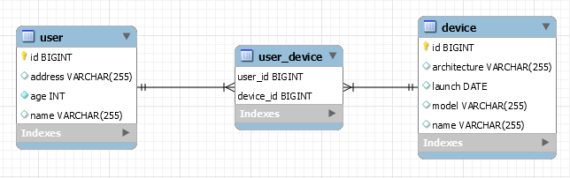

## Ordering The Set Of Associated Entities In `@ManyToMany` Association Via `@OrderBy`

Description: In case of `@ManyToMany` association, we always should rely on `Set` (not on `List`) for mapping the collection of associated entities (entities of the other parent-side). It is well-known that `HashSet` doesn't have a predefined entry order of elements. If this is an issue then this application relies on `@OrderBy` which adds an `ORDER BY` clause in the SQL statement. The database will handle the ordering. Further, Hibernate will preserve the order via a `LinkedHashSet`.

This application uses two entities, `User` and `Device`, involved in a lazy bidirectional many-to-many relationship. First, we fetch a 'Device' by name. Further, we call `getUsers()` to fetch the users of this device. The fetched users are ordered descending by name. The ordering is done by the database as a result of adding `@OrderBy("name DESC")`, and is preserved by Hibernate.

**Key points:**

- ask the database to handle ordering and Hibernate to preserve this order via `@OrderBy`
- this works with HashSet, but doesn't provide consistency across all transition states (e.g., transient state)
- for consistency across the transient state as well, consider using explicitly LinkedHashSet instead of HashSet

**Note:** Alternatively, we can use `@OrderColumn`. This gets materialized in an additional column in the junction table. This is needed for maintaining a permanent ordering of the related data.

